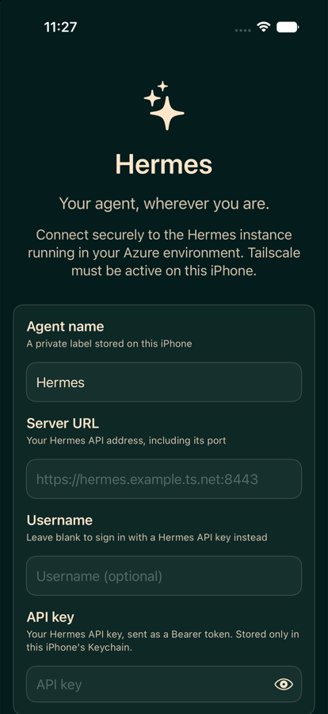

# Hermes for iPhone

Talk to your own [Hermes Agent](https://github.com/NousResearch/hermes-agent) from your phone — the same agent, the same conversations, wherever you are.



Hermes is a self-hosted AI agent that runs tools, keeps sessions, and does real work on a machine you control. It ships with a web dashboard and a terminal UI. This is a native iOS client for the same agent: start a conversation at your desk, pick it up on your phone, and approve a risky command from wherever you happen to be.

> **Status:** working and in active development. Chat, sessions, Markdown, tool visibility, and dangerous-command approvals are implemented and verified against a live deployment on a physical device. Automations and push notifications are not started.

## What you need

- A running Hermes Agent with its **API server** enabled, reachable from your phone. If it is published over [Tailscale](https://tailscale.com), install the Tailscale app and sign in to the same tailnet.
- Its API key (`API_SERVER_KEY`).
- Xcode 26.2 or newer to build the app. There is no App Store build; you install it yourself.

Don't have Hermes deployed? [hermes-agent-azure](https://github.com/mikefelder/hermes-agent-azure) is a Terraform stack that runs it on Azure Container Apps behind a private Tailscale endpoint.

## Quick start

```bash
git clone <this-repo> && cd Hermes
cp Config/Local.xcconfig.example Config/Local.xcconfig
```

Set `HERMES_BUNDLE_ID` and `HERMES_DEVELOPMENT_TEAM` in that file, then open `Hermes.xcodeproj` and run on your device. On first launch enter:

| Field | Value |
| --- | --- |
| **Server URL** | Your API server address **including its port**, e.g. `https://hermes.example.ts.net:8443` |
| **Username** | Leave blank |
| **API key** | Your `API_SERVER_KEY` |

Leaving the username blank is what selects API-key authentication. Tap **Test connection**, then **Save**.

**The single most common mistake** is pointing the app at the Hermes *web dashboard* instead of the API server. They are different surfaces, often on the same hostname and different ports. The dashboard answers with an HTML login page, and the app will tell you so. To check a host before configuring the app:

```bash
scripts/probe-hermes.sh --url https://hermes.example.ts.net:8443 --key "$HERMES_API_KEY"
```

## What it does

- **Chat** with your agent, streamed token by token, with Markdown, tables, and syntax-neutral code blocks that you can copy.
- **Sessions** shared with every other Hermes client. A conversation you started in the web dashboard or the terminal UI appears here and can be continued, and vice versa.
- **See tool work.** When the agent runs a terminal command or reads a file, you see which tool is running and, when the turn ends, what it did.
- **Approve dangerous commands** from your phone. When Hermes wants to run something risky it asks, and you can allow it once, allow it for the session, allow it always, or deny it.
- **Survive bad networks.** If a connection drops mid-turn the app asks the server what actually happened rather than guessing, and never silently resends work that may already be running.
- **Keep your drafts.** Unsent text survives force-quitting the app.

Your API key is stored only in the iPhone Keychain. Conversations are never copied to a third party — the app talks directly to your own server.

## How it works

Hermes owns everything: sessions, transcripts, tool execution, skills, and configuration. This app reads and writes that state rather than keeping its own copy, which is why a conversation is genuinely the same object across every client.

The app asks the server what it supports (`GET /v1/capabilities`) and turns features on accordingly, so an older or differently configured Hermes degrades honestly instead of failing in confusing ways. A turn uses the richest protocol available:

| Protocol | Used when |
| --- | --- |
| `POST /v1/runs` | Approvals are supported — the only path that can prompt you before a dangerous action |
| `POST /api/sessions/{id}/chat/stream` | A session is open and approvals are unavailable |
| `POST /v1/responses` | No session, but server-side continuity is supported |
| `POST /v1/chat/completions` | Universal fallback |

One deliberate trade: there is no offline cache, so an unreachable server means no transcript to read.

For the full picture see the [technical architecture](docs/TECHNICAL_ARCHITECTURE.md) and [Hermes integration](docs/HERMES_INTEGRATION.md) documents.

## Security

- The API key lives in the Keychain with `ThisDeviceOnly` accessibility, never in preferences, logs, or backups.
- HTTPS is required. Redirects that change host or downgrade to HTTP are refused, so credentials cannot follow a redirect off your server.
- Assistant text and tool output are display content only. They are never parsed into approvals or actions, and Markdown cannot load remote images, run scripts, or open a link without you tapping it.
- Nothing is logged that could contain your prompts, responses, credentials, or server address.

The [security and privacy](docs/SECURITY_PRIVACY.md) document covers the threat model in full.

## Behaviour worth knowing

- **Two surfaces, one hostname.** In the reference Azure deployment a Tailscale sidecar publishes the web dashboard on `443` and the API server on `8443`. Only the second is an API.
- **Proxy deployments.** If something in front of Hermes validates a username and password, enter both and the app sends HTTP Basic instead of a bearer key.
- **Editing a saved connection.** Leaving the secret blank keeps the stored one. Switching a profile between password and API-key authentication clears it deliberately, because a secret saved for one mode does not apply to the other.
- **Alternate app icons.** Four are included, switchable in Settings → Appearance → App Icon.
- **Privacy cover.** App content is hidden whenever the app is not frontmost, so the app switcher shows nothing.

## Documentation

| Document | Purpose |
| --- | --- |
| [Product specification](docs/PRODUCT_SPEC.md) | Goals, personas, journeys, complete feature catalog, scope, and acceptance criteria |
| [Technical architecture](docs/TECHNICAL_ARCHITECTURE.md) | Native app structure, state, networking, persistence, models, and lifecycle |
| [Hermes integration](docs/HERMES_INTEGRATION.md) | Verified API surfaces, compatibility strategy, Azure/Tailscale contract, and endpoint mapping |
| [Design system](docs/DESIGN_SYSTEM.md) | Hermes visual language, mobile information architecture, components, motion, and accessibility |
| [Security and privacy](docs/SECURITY_PRIVACY.md) | Threat model, credential handling, transport, permissions, logging, and privacy requirements |
| [Push notifications](docs/PUSH_NOTIFICATIONS.md) | APNs architecture, relay contract, registration, delivery, deep links, and failure modes |
| [Quality strategy](docs/QUALITY_STRATEGY.md) | Unit, integration, UI, accessibility, performance, security, and release validation |
| [Delivery plan](docs/DELIVERY_PLAN.md) | Milestones, work breakdown, exit criteria, risks, and decisions |

## Roadmap

Chat, sessions, Markdown, capability discovery, and turn reconciliation are in
place. The next work is claiming more of what the server already offers:
explicit session creation so every conversation appears in Sessions, run
approvals for dangerous commands, session management (rename, delete, fork), and
a per-session model picker.

Known gaps:

- A new conversation is not bound to a session until one is opened, so it appears
  in Sessions only after Hermes creates it implicitly.
- Approvals and clarifications are not implemented, though the server advertises
  `run_approval_response` and `approval_events`.
- Drafts and uncertain-turn records are not persisted, so an app kill during a
  turn loses the reconciliation marker.
- Sessions and transcripts are not paginated; the list and history are capped.
- Reasoning content returned by the server is not displayed.
- No offline reading: without a cache there is no transcript when the tailnet is
  unreachable. This is a deliberate trade, revisitable as a read-through cache.
- Connection probing has no injected `URLProtocol`/mock transport tests, and the
  staged test includes no streaming framing probe.
- Network path and protected-data availability are not observed.
- No `HermesUITests` target, local mock server, CI workflow, `.xcconfig`, or
  string catalog.
- No APNs relay.

The specifications under `docs/` predate the discovery that the API server
exposes session resources, approvals, and capability discovery. They still
describe a `/mobile/v1` companion adapter as required for sessions, and a
SwiftData cache as the persistence strategy. Both assumptions are superseded by
this README; the documents will be reconciled as those areas are implemented.

Acceptance criteria and later milestones are in the [Delivery plan](docs/DELIVERY_PLAN.md).

## Development

### Requirements

- Xcode 26.2 or newer
- iOS 26.2 deployment target
- A reachable Hermes Agent instance with the API server enabled
- The Tailscale app, signed in to the same tailnet, when the server is published as a Tailscale Service

### Signing

Signing identity lives in `Config/Signing.xcconfig`, which holds neutral defaults and optionally includes `Config/Local.xcconfig`. That second file is ignored by git, so no developer's identity enters the repository:

```bash
cp Config/Local.xcconfig.example Config/Local.xcconfig
```

Set `HERMES_BUNDLE_ID` and `HERMES_DEVELOPMENT_TEAM` there. Simulator builds and the test suite need neither; only device builds do. The Keychain service and log subsystem are derived from the bundle identifier, so a fork gets its own namespaces automatically.

### Build and test

The unit tests cover URL normalization and unsafe-URL rejection, authorization header construction, redirect policy, health and model-list interpretation, SSE parsing, chat event decoding, response previews, and Keychain credential round-tripping.

```bash
xcodebuild test \
  -project Hermes.xcodeproj \
  -scheme Hermes \
  -destination 'platform=iOS Simulator,name=iPhone 17 Pro'
```

Additional checks used before a release checkpoint:

```bash
xcodebuild build \
  -project Hermes.xcodeproj \
  -scheme Hermes \
  -configuration Debug \
  -sdk iphonesimulator \
  -derivedDataPath /tmp/HermesDerivedData \
  CODE_SIGNING_ALLOWED=NO

xcodebuild test \
  -project Hermes.xcodeproj \
  -scheme Hermes \
  -destination 'platform=iOS Simulator,name=iPhone 17,OS=26.2' \
  -derivedDataPath /tmp/HermesDerivedData

xcodebuild clean build \
  -project Hermes.xcodeproj \
  -scheme Hermes \
  -configuration Release \
  -destination 'generic/platform=iOS Simulator' \
  -derivedDataPath /tmp/HermesReleaseDerivedData \
  CODE_SIGNING_ALLOWED=NO

xcodebuild analyze \
  -project Hermes.xcodeproj \
  -scheme Hermes \
  -configuration Debug \
  -destination 'generic/platform=iOS Simulator' \
  -derivedDataPath /tmp/HermesAnalyzeDerivedData \
  CODE_SIGNING_ALLOWED=NO

DEVELOPER_DIR=/Applications/Xcode-beta.app/Contents/Developer \
xcodebuild clean build \
  -project Hermes.xcodeproj \
  -scheme Hermes \
  -configuration Debug \
  -destination 'generic/platform=iOS Simulator' \
  -derivedDataPath /tmp/HermesXcode27DerivedData \
  CODE_SIGNING_ALLOWED=NO
```

Do not pass `CODE_SIGNING_ALLOWED=NO` to the Keychain-inclusive test command. An unsigned simulator host causes Security framework error `errSecMissingEntitlement (-34018)`. Normal simulator ad-hoc signing makes the Keychain test pass.

If a connected physical iPhone is locked, Xcode may repeatedly log failure to start `com.apple.mobile.notification_proxy`. This is unrelated to a test explicitly targeted at the simulator.

### Project layout

```text
Hermes/
├── App/
│   ├── AppEnvironment.swift       # production dependency composition
│   ├── AppModel.swift             # active profile/capability/application state
│   └── RootView.swift             # restore gate, tabs, placeholders, privacy cover
├── DesignSystem/
│   ├── HermesTheme.swift          # colors, spacing, card/screen modifiers
│   └── Components/ConnectionStatusPill.swift
├── Domain/
│   ├── Chat/ChatModels.swift      # chat and agent event models
│   └── Connection/                # profile, capabilities, checks, errors, interpreters
├── Features/
│   ├── Chat/                     # turn coordinator, conversation, chat screen, Markdown views
│   ├── Connection/               # connection editor model and form
│   ├── Onboarding/WelcomeView.swift
│   ├── Sessions/                 # server session list
│   └── Settings/                 # settings screen and app-icon picker
├── Infrastructure/
│   ├── API/                      # SSE parser and the three stream decoders
│   ├── Auth/CredentialStore.swift
│   ├── Logging/HermesLogger.swift
│   ├── Networking/               # HTTP, chat streaming, sessions, capabilities
│   └── Persistence/ConnectionSettingsStore.swift
├── ContentView.swift              # compatibility wrapper/preview entry
└── HermesApp.swift                # app entry and root dependency state

HermesTests/                       # nine Swift Testing suites
scripts/probe-hermes.sh            # endpoint discovery helper
design/app-icons/                  # icon source masters, outside the app bundle
docs/                              # product and engineering specifications
```

Xcode uses file-system-synchronized groups, so empty-looking `PBXSourcesBuildPhase` arrays in `project.pbxproj` are expected. Do not manually add each Swift file to those arrays.

### Engineering notes

- `AppEnvironment` owns protocol-backed settings, credential, connection-test, and logging dependencies.
- `AppModel` restores and transactionally updates the active server profile.
- `ServerProfile` normalizes host casing and trailing slashes while preserving ports and reverse-proxy path prefixes.
- Production configuration requires HTTPS and rejects URLs containing embedded credentials, queries, or fragments.
- Authentication supports HTTP Basic (username + password) and Bearer API keys, selected by whether a username is present. Basic usernames containing `:` are rejected to avoid ambiguous encoding.
- The connection test reads the server's `WWW-Authenticate` challenge and reports whether the server expects an API key or a username/password.
- Passwords use a generic-password Keychain item with `kSecAttrAccessibleWhenUnlockedThisDeviceOnly` and never enter `ServerProfile` or `UserDefaults`.
- Connection requests use an ephemeral `URLSession` with no cookies, credential storage, or cache.
- Same-host HTTPS redirects are followed (common behind reverse proxies and Tailscale front ends); redirects that change host or downgrade to HTTP are rejected so the `Authorization` header is never sent to another origin. Endpoint construction stays within the configured HTTPS origin.
- Connection testing probes `GET /health`, authenticated `GET /v1/models`, and `GET /v1/capabilities`.
- Capabilities are discovered from the server, persisted, and refreshed on launch. They select the chat protocol and gate every optional feature; an unknown server degrades to chat only.
- `HermesEndpoint` is the single implementation of endpoint construction and the same-origin rule, shared by every client.
- Chat streaming rejects a response whose final URL left the configured origin before reading any of its body, and a generation guard prevents a cancelled turn from appending to a newer one.
- `ChatTurnCoordinator` owns one foreground stream per conversation and tracks acceptance, so a dropped turn is reconciled against the server transcript instead of being blindly resent.
- Assistant text and tool output are display content only; neither is treated as structured metadata or as an approval.
- Errors distinguish invalid configuration, offline, timeout, TLS, unauthorized, forbidden, unavailable, incompatible response, redirect, and cancellation states.
- `ServerProfile` is explicitly nonisolated so its `Codable` conformance remains safe from persistence actors under Swift 6 isolation rules.

### Toolchain and project caveats

- `Hermes.xcodeproj/project.pbxproj` contains the `HermesTests` target. Its `buildConfigurationList` must remain `AA100000000000000000000B`; an interrupted edit previously produced an invalid 25-character reference and caused empty test settings.
- The deployment target is intentionally iOS 26.2 because that SDK is installed. Lowering it remains an open product decision, not a build repair.
- The physical target runs the iOS 27 public beta, but the deployment target remains iOS 26.2. Do not raise it merely to run on iOS 27; an iOS 26.2-targeted app remains compatible unless it adopts iOS 27-only APIs.- `xcode-select -p` points at stable `/Applications/Xcode.app/Contents/Developer`. Prefix Beta command-line builds with `DEVELOPER_DIR=/Applications/Xcode-beta.app/Contents/Developer` rather than changing the global selection.
- Xcode 27 Beta's Swift 6.4 compiler crashed on the async Objective-C thunk for `URLSessionTaskDelegate` redirect handling. `HermesHTTPClient` uses the equivalent completion-handler callback instead.
- Xcode 27 rejects actor initialization with a non-Sendable `UserDefaults` parameter. `ConnectionSettingsStore` is a small `@unchecked Sendable` final class; its async protocol boundary and persistence behavior are unchanged.
- Documentation lives only in the root `docs/` tree. A former `Hermes/docs/` copy was removed because the app target's file-synchronized group shipped it inside the app bundle.
- The app currently forces dark appearance in `HermesApp.swift`.
- No external Swift packages are installed.
- No real credentials, hostnames, API keys, APNs keys, or production fixtures are committed.

## Primary references

- [Hermes Agent repository](https://github.com/NousResearch/hermes-agent)
- [Hermes product page](https://hermes-agent.nousresearch.com/)
- [Open WebUI/API server guide](https://hermes-agent.nousresearch.com/docs/user-guide/messaging/open-webui)
- [Messaging gateway guide](https://hermes-agent.nousresearch.com/docs/user-guide/messaging)
- [CLI guide](https://hermes-agent.nousresearch.com/docs/user-guide/cli)
- [Voice mode guide](https://hermes-agent.nousresearch.com/docs/user-guide/features/voice-mode)

Pin the deployed Hermes release during implementation and update the compatibility matrix before shipping.
